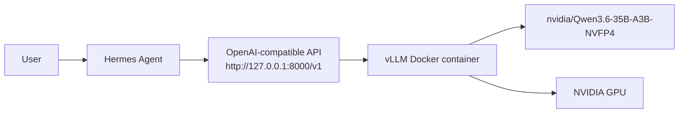

# Hermes Agent on DGX Spark with vLLM

This repository automates a local Hermes Agent setup that uses vLLM instead of
Ollama. The target model is:

```text
nvidia/Qwen3.6-35B-A3B-NVFP4
```

The flow is:

1. Run vLLM in Docker with the Hugging Face model.
2. Expose vLLM's OpenAI-compatible API on `http://127.0.0.1:8000/v1`.
3. Install Hermes Agent if needed.
4. Configure Hermes to use the local custom endpoint.

## Architecture



- Hermes is the chat agent you interact with from the CLI or gateway.
- vLLM runs locally in Docker and serves the model through an OpenAI-compatible API.
- Hermes points at that local API instead of a remote model provider or Ollama.
- The model weights come from Hugging Face and inference runs on the local NVIDIA GPU.

## Prerequisites

- DGX Spark or another NVIDIA Blackwell/Hopper Linux host.
- Docker and NVIDIA Container Toolkit.
- A Hugging Face token in `HF_TOKEN`.
- Network access to pull the vLLM container and model weights.

Create a Hugging Face token at:

```text
https://huggingface.co/settings/tokens
```

## Quick Start

```bash
export HF_TOKEN="hf_..."
./scripts/setup-hermes-vllm.sh install-all
```

Or use a local `.env` file:

```bash
cp .env.example .env
editor .env
./scripts/setup-hermes-vllm.sh install-all
```

After the install finishes:

```bash
hermes -z "Reply exactly HERMES_OK"
hermes
```

## Common Commands

Start vLLM only:

```bash
./scripts/setup-hermes-vllm.sh start-vllm
```

Install Hermes only:

```bash
./scripts/setup-hermes-vllm.sh install-hermes
```

Configure Hermes against the local vLLM endpoint:

```bash
./scripts/setup-hermes-vllm.sh configure-hermes
```

Install vLLM as a user systemd service:

```bash
./scripts/setup-hermes-vllm.sh install-vllm-service
systemctl --user status hermes-vllm
```

Verify the endpoint, Hermes configuration, and a bounded sample response:

```bash
./scripts/setup-hermes-vllm.sh verify-vllm
./scripts/setup-hermes-vllm.sh verify-hermes
./scripts/setup-hermes-vllm.sh sample-response
```

Stop vLLM:

```bash
./scripts/setup-hermes-vllm.sh stop-vllm
```

## Configuration

Override defaults with environment variables:

```bash
export VLLM_IMAGE="vllm/vllm-openai:v0.23.0"
export HF_MODEL_HANDLE="nvidia/Qwen3.6-35B-A3B-NVFP4"
export VLLM_PORT="8000"
export VLLM_MAX_MODEL_LEN="65536"
export VLLM_GPU_MEMORY_UTILIZATION="0.85"
export VLLM_MAX_NUM_SEQS="4"
export VLLM_MAX_NUM_BATCHED_TOKENS="8192"
```

For DGX Spark, the script uses the environment settings recommended on the
model card:

```bash
VLLM_USE_FLASHINFER_MOE_FP4=0
VLLM_FP8_MOE_BACKEND=flashinfer_cutlass
FLASHINFER_DISABLE_VERSION_CHECK=1
CUTE_DSL_ARCH=sm_121a
```

## Telegram Gateway

The script does not automate Telegram bot creation or allowed-user selection.
After Hermes is installed and configured, run:

```bash
hermes gateway setup
```

Restrict the bot to your Telegram user ID when prompted.

## Notes

- vLLM is bound to localhost by default: `127.0.0.1:${VLLM_PORT}`.
- The Hermes base URL is `http://127.0.0.1:${VLLM_PORT}/v1`.
- The model card lists vLLM as the supported runtime for this NVFP4 checkpoint.
- The first vLLM start downloads model weights and can take a while.
